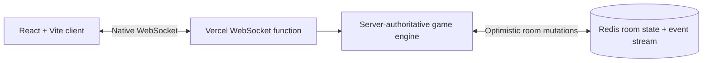

<p align="center">
  
</p>

<h1 align="center">XO Royale</h1>

<p align="center">
  A polished, real-time Tic Tac Toe table for private matches with friends.
</p>

<p align="center">
  <a href="https://tic-tac-toe-royale.vercel.app/">
    
  </a>
  <a href="https://github.com/NasserAlbusaidi/tic-tac-toe-royale/actions/workflows/ci.yml">
    
  </a>
  
</p>

<p align="center">
  <a href="https://tic-tac-toe-royale.vercel.app/"><strong>Play the live game</strong></a>
  ·
  <a href="#game-modes">Game modes</a>
  ·
  <a href="#run-locally">Run locally</a>
  ·
  <a href="#architecture">Architecture</a>
</p>

## What is XO Royale?

XO Royale turns Tic Tac Toe into a private browser table. Create a room, share
the five-character code, and play from any modern browser—no account required.

It includes:

- real-time private rooms for two players;
- Normal, Misère, and Ultimate Tic Tac Toe;
- configurable best-of match lengths with scores and round history;
- mobile-first controls without sacrificing the desktop table;
- player chat, unread badges, a separate game log, and read-only spectators;
- secure reload and reconnect using private server-issued resume tokens; and
- Redis-backed room state for reliable multi-instance hosting on Vercel.

## Game modes

| Mode | Objective |
| --- | --- |
| **Normal** | Make three marks in a row to win the round. |
| **Misère** | Making three in a row loses the round. |
| **Ultimate** | Win small boards to claim the 3×3 meta grid. The cell you choose sends your opponent to the matching small board; if that board is closed, they may play anywhere. |

Ultimate moves use `board.cell` notation. For example, `5.3` means board 5,
cell 3, and sends the next player to board 3.

## Architecture



- The server validates every move, turn, role, chat message, and room action.
- Production room state is shared through Redis and expires after six hours of
  inactivity.
- Local development uses the same engine with an in-memory room store.
- Public room payloads never expose private resume credentials.

## Run locally

### Prerequisites

- [Node.js 24](https://nodejs.org/)
- npm 11 or newer

### Start the table

```bash
git clone https://github.com/NasserAlbusaidi/tic-tac-toe-royale.git
cd tic-tac-toe-royale
npm ci
npm run dev
```

This starts:

- the WebSocket room server at `http://127.0.0.1:4242`; and
- the Vite client at `http://127.0.0.1:5173`.

Open two browser windows, create a room in one, and join it from the other.
Redis is optional locally; without `REDIS_URL`, rooms use in-memory storage.

## Configuration

Copy `.env.example` to `.env.local` only when you want local Redis-backed room
state:

```dotenv
REDIS_URL=
```

`REDIS_URL` must be a server-side Redis-compatible connection string. Never
expose it through a `VITE_` environment variable or commit a real credential.

## Verification

```bash
npm run check
npm audit --omit=dev
```

`npm run check` runs linting, game-engine and WebSocket hub tests, a production
build, and syntax checks for every server and smoke-test entry point.

With the local server running, test the real WebSocket protocol from a second
terminal:

```bash
npm run smoke
```

You can also target a deployed environment:

```bash
npm run smoke -- --url wss://your-project.vercel.app/api/ws
```

The smoke test creates two temporary players, starts an Ultimate match, and
verifies the `5.3 → board 3 → 3.1 → board 1` routing flow.

## Deploy to Vercel

1. Import the repository into [Vercel](https://vercel.com/).
2. Provision a Redis-compatible database. The
   [Upstash Vercel integration](https://upstash.com/docs/redis/howto/vercelintegration)
   is one serverless option.
3. Add its native connection string as the server-side `REDIS_URL` environment
   variable for Production and Preview.
4. Deploy the project.

```bash
npx vercel --prod
```

After deployment, `GET /api/health` should return `"store":"redis"`. The
client reconnects automatically when a WebSocket function reaches its runtime
limit.

## Privacy and security

- Player identities are protected with 256-bit resume tokens; only SHA-256
  token hashes are stored with the room.
- Chat is limited, rate-limited, scoped to the room, and readable by
  spectators. It is not end-to-end encrypted.
- Room data and chat expire with the room after six hours of inactivity.
- The public demo is a friendly-game service, not a permanent messaging or
  identity platform.

Please report vulnerabilities using the process in [SECURITY.md](SECURITY.md).

## Contributing

Contributions are welcome once you have read [CONTRIBUTING.md](CONTRIBUTING.md).
For substantial changes, open a feature request first so the gameplay and
protocol impact can be agreed before implementation.

## License

A software license has not yet been selected. Until one is added, the source is
available for viewing but no reuse rights are granted by default.
